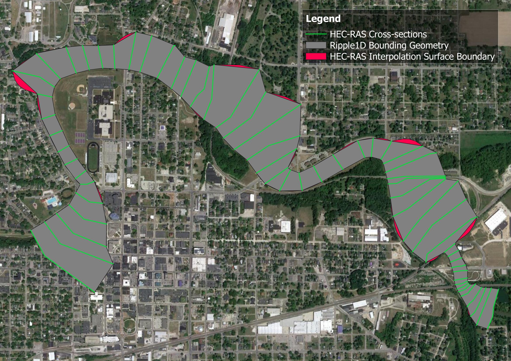

# Frequently Asked Questions

??? "What is ripple1d?"
    `ripple1d` is a Python utility that repurposes HEC-RAS models for use in the production of Flood Inundation Maps (FIMs) and scenario databases to support near-real-time flood forecasting within NOAA's National Water Model (NWM).
    With the utility, HEC-RAS models can be broken up into smaller sub models for each NWM reach within the modeled domain.
    Sub models may then be used to develop reach-scale scenarios and FIM.

    ripple1d currently includes functions to:

    - Export HEC-RAS model geometry and metadata from proprietary HEC formats to geopackages and [SpatioTemporal Asset Catalog (STAC)](https://stacspec.org/en) items;
    - Associate HEC-RAS model components (e.g. cross sections, structures, etc) with NWM reaches;
    - Create NWM reach-specific HEC-RAS models;
    - Run HEC-RAS models for a range of hydraulic conditions (scenarios);
    - Generate reach-scale scenario databases; and
    - Generate inundation depth grids for these scenarios.

??? "Why use ripple1d?"
    While novel methods for mapping inundation extents across broad spatial scales are under active development, HEC-RAS models remain the industry standard, and large collections of engineer-certified HEC-RAS models have been developed in recent years in support of Federal Emergency Management Agency (FEMA) Digital Flood Insurance Rate Map (DFIRM) and Base Level Engineering (BLE) initiatives.
    ripple1d provides utilities to leverage these large catalogs in an operational flood forecasting setting by aligning HEC-RAS model domains with forecast domains.
    Aligning model domains reduces computational overhead and allows models to easily interface with other modules and functions of the NWM.

??? "What kind of models are supported?"
    Ripple1D currently requires the following model specifications

    - 1D models.  2D is not currently supported.
    - Steady-state models.  Unsteady and Quasi-unsteady flow is not supported.
    - Models made with HEC-RAS version <3.0 and >6.3.1 may be supported but have not been officially tested.
    - Models using english units.  Metric is not supported.

??? "What version of HEC-RAS is used for model execution?"
    Ripple1D currently supports HEC-RAS v6.3.1 for model execution.

??? "What boundary condition is used?"
    A normal depth downstream boundary condition is applied for the initial run of all submodels.
    The slope used is the NWM reach slope from the hydrofabric data for the most downstream reach that intersects the submodel's final downstream cross section.
    If no such reach is found, the current reach's slope is used instead.
    If no slope is available, a default of 0.001 ft/ft is used (defined in ripple1d/consts.py as DEFAULT_ND_SLOPE).
    The selected slope is clamped to [MIN_ND_SLOPE, MAX_ND_SLOPE] (defined in ripple1d/consts.py) to keep the 1D HEC-RAS steady-flow solver numerically stable.

    Subsequent known water surface elevation (KWSE) runs use a range of downstream known water surface elevations for each discharge.
    Each discharge is executed over its own range: from a per-discharge floor up to a shared ceiling (max_elevation), in depth_increment steps.
    The floor comes from min_elevation_curve, a lower-bound curve of [discharge, elevation] pairs supplied by the caller.
    The caller would typically develop it in this this way; for a given discharge (Q_1us), the floor is derived by 1) looking at the scenarios of the next downstream reach, 2) subsetting to the set (1 or more) of scenarios with greatest discharge less than Q_1us, and 3) selecting the scenario yielding the lowest upstream WSE from the subset and recording that upstream WSE.
    When Q_1us is less than the lowest modeled downstream discharge, the floor is taken from the lowest modeled downstream discharge.
    The shared ceiling is derived by the user by finding the maximum upstream WSE from any scenario in the next downstream reach.

??? "Which plan, geometry, and flow files are used?"
    Source model files are scanned and a "primary" plan file is identified as the following

    - If the active plan does not contain encroachments, it is used.
    - If the active plan contains encroachments, the first plan without encroachments is used.
    - If no plans are found without encroachments, an error is raised.

    If the flow file associated with the "primary" geometry is not steady, an error is raised.
    Otherwise, the flow and geometry files specified in the "primary" plan file are used.

??? "How are structures handled?"
    Ripple1D currently supports models with inline structures (bridges, culverts, weirs, and gates) but not lateral structures.
    If a lateral structure is present, the model may be run without error, but lateral structure connections will be noted in the source model quality metrics.

    Note that Ripple1D will not enforce proper modeling of bridges (two cross-sections upstream and two downstream, expansion and contraction coefficients, ineffective flow areas, etc).
    Proper modeling depends on the quality of the source model.

??? "What horizontal datums and units are supported?"
    **Models:** A source model may be in any coordinate reference system (CRS) supported by HEC-RAS.
    In the final steps of FIM library generation, maps may be reprojected to any destination CRS.

    **DEMs and maps:** Users may specify the desired horizontal resolution of generated DEM and FIM maps.

??? "What vertical datums and units are supported?"
    **Models:** Ripple1D assumes that all source models use the same vertical datum as the DEM used for mapping.
    In the default case of 1/3 arcsecond USGS DEMs, this means that all models are assumed to use ft NAVD88.
    As detailed above, source models must use english units (ft instead of meters)

    **DEMs and maps:** Ripple1D allows the user to import any DEM for mapping, however, if a DEM uses meters as the vertical scale, that must be specified so that the DEM can be converted to feet.
    All FIMs created will use feet as the vertical unit.

??? "How are modeled flow ranges determined?"
    For the initial normal depth run, discharges will range between the following.

    - The minimum of the source model minimum flow and 0.9 times the National Water Model reach high_flow_threshold
    - The maximum of the source model maximum flow and 1.2 times the 100-year discharge of the National Water Model reach.

    Discharge intervals within that range are controlled by the user.

??? "How are HEC-RAS divergences handled during conflation?"
    While the National Water Model network is a strict binary tree, HEC-RAS allows modeling of diverging flow paths.
    If a source HEC-RAS model has divergences, conflation will fail.

??? "What is an eclipsed reach?"
    When a National Water Model reach does not intersect any source model cross-sections but both its upstream and downstream neighbors intersect cross-sections on the same source model, that reach is defined as eclipsed.
    This reach will be tagged as such in the conflation file.
    This reach will fall entirely within the FIM footprint of a different submodel.

??? "Why are downstream cross-sections not intersecting the NWM reach?"
    In order to create a seamless FIM, models must share upstream and downstream cross-sections.
    The decision was made that each reach should extend one cross-section downstream of its last intersecting cross-section in order to close the between-model gap.

??? "Why is this upstream cross-sections not intersecting the NWM reach?"
    In first-order tributaries of the National Water Model network, if a HEC-RAS source model extends further upstream than the reach terminus, conflation will extend a sub model one cross-section upstream to fully map the upstream end of the reach.

??? "How are confluences handled?"
    When a confluence is present in both the HEC-RAS source model and the National Water Model network, Ripple1D will attempt to conflate the two confluencing RAS reaches to the two confluencing NWM reaches and the outlet RAS reach to the outlet NWM reach.

    If no junction is included in the HEC-RAS source model (common in BLE models), the confluencing reach(es) will be treated as seperate models.
    This may lead to visible gaps in FIM where cross-sections are not overlapped from upstream model to downstream model.

??? "What is the concave hull layer of the RAS geometry geopackage?"
    The concave hull layer delineates the approximate area where HEC-RAS can map inundation.
    The concave hull is created by generating polygons between each adjacent pair of cross-sections in a model and merging them together.
    This area is slightly different than the interpolation surface of RASMapper.
    The interpolation surface has added functions to follow the stream centerline and bank lines.
    An example of these small differences are shown below for the HEC-RAS Muncie model.

    
